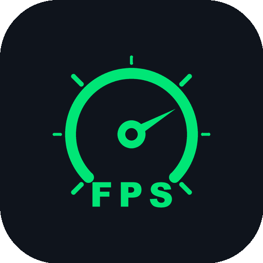
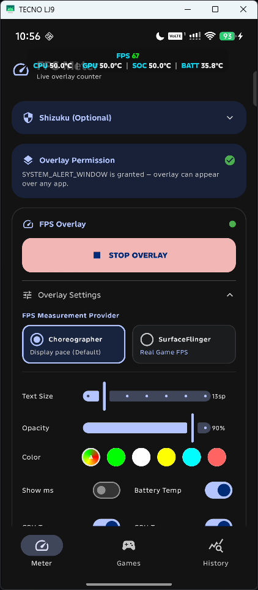
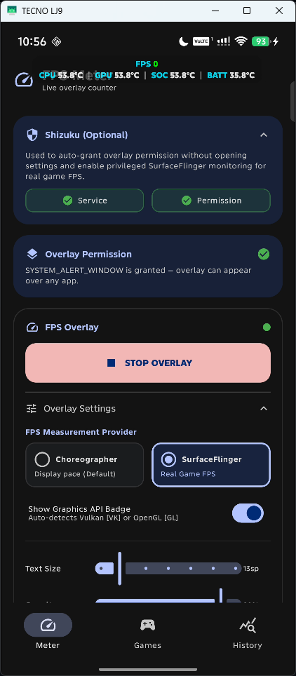
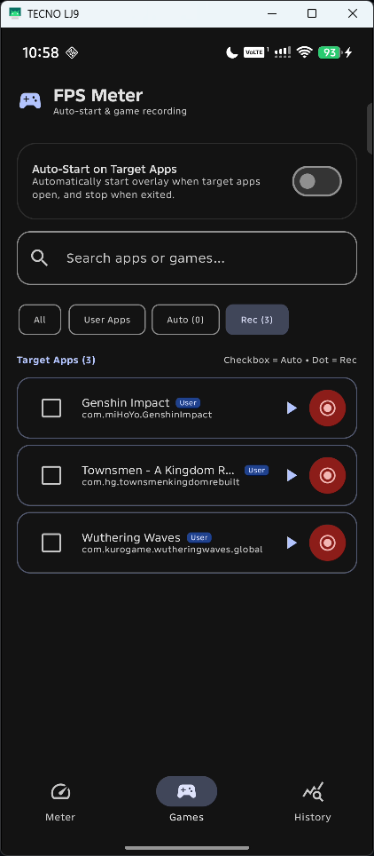
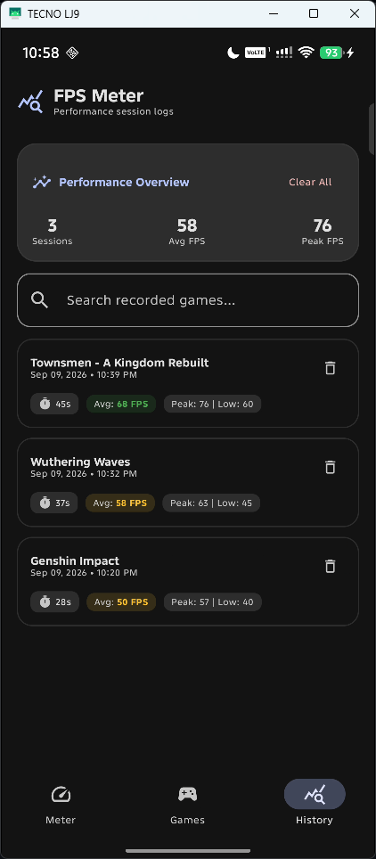
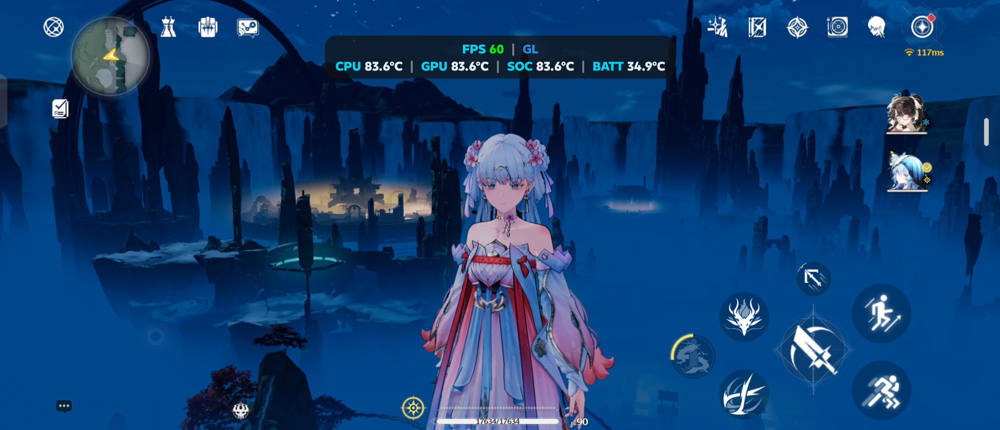
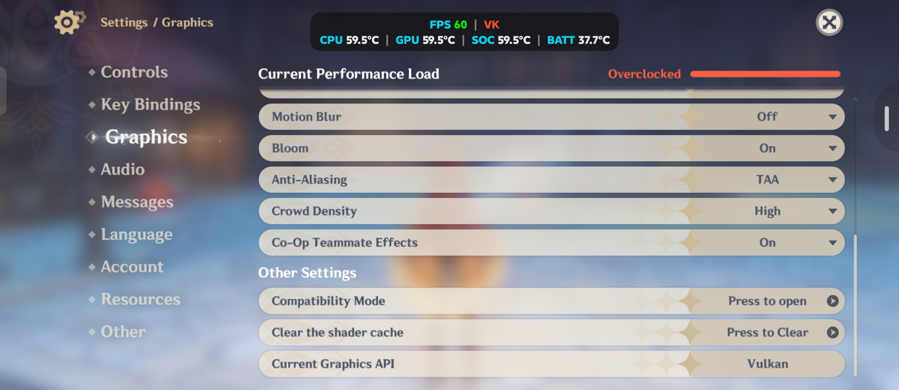

  

  # FPS Meter Android

  
  
  
  
  

  

    A high-performance, lightweight FPS monitoring tool for Android. This application provides a real-time frame rate overlay inspired by the Samsung Perf Z aesthetic, offering a professional monitoring experience for mobile gaming and performance testing.
      
    <strong>Official Website & Showcase:</strong> <a href="https://rdevz-ph.github.io/FPS-Meter-Android/">https://rdevz-ph.github.io/FPS-Meter-Android/</a>
  

## How It Works

> [!NOTE]
> Here is a high-level overview of how the application operates:
> - **FPS Measurement Providers**:
>   - **Choreographer (Default)**: Uses Android's `Choreographer` API to receive frame callbacks, measuring elapsed time to calculate real-time frames per second (FPS). Frame time (MS) is derived directly from this rate.
>   - **SurfaceFlinger (Game FPS via Shizuku)**: Connects to Android's compositor via privileged Shizuku shell commands to measure real game frame presentation buffers from active `SurfaceView` buffer queues.
> - **Automatic Graphics API Detection**: Automatically detects whether the foreground game is rendering with **Vulkan** or **OpenGL ES** (tested on games such as Genshin Impact and Wuthering Waves) using system GPU telemetry (`dumpsys gpu` and `dumpsys gfxinfo`), adapting the measurement method accordingly.
> - **Hardware Temperature Telemetry**:
>   - **Battery Temp (`TEMP (BATT)`)**: Uses a dynamic `BroadcastReceiver` for `Intent.ACTION_BATTERY_CHANGED` to read and display real-time battery temperature without needing special permissions.
>   - **SoC, CPU & GPU Temps (`SOC`, `CPU`, `GPU`)**: Queries Android's Thermal HAL (`dumpsys thermalservice`) and Linux sysfs thermal zones (`cpu-*-usr`, `gpuss-*-usr`) via Shizuku privileged shell access to monitor accurate live silicon hotspot, individual CPU core, and GPU temperatures during gaming across Qualcomm Snapdragon and MediaTek platforms.
> - **Adaptive Dynamic Layout**: Automatically presents a clean single-line pill when 1 to 3 metrics are enabled, and organizes into a structured two-line layout (Line 1: Performance metrics, Line 2: Temperatures) when 4 or more metrics are active.
> - **Material 3 Navigation & Dedicated Screens**: Modern navigation featuring Overlay settings, Games manager with 1-tap game launching, and dedicated FPS session History.
> - **Per-Game FPS Recording & Statistics**: In-memory session tracking aggregating average, min, and max FPS and duration with zero sample-by-sample disk overhead.
> - **Floating Assistive Bubble & Quick Menu**: Provides an optional draggable floating on-screen bubble (`FloatingToggleButton`) that expands into a quick HUD menu to start/stop game FPS recording and toggle overlay visibility from inside any active game.
> - **Quick Settings Panel Tile**: Exposes an Android `TileService` (`FpsTileService`) that allows 1-tap toggling of the FPS overlay directly from the notification pull-down shade without opening the main app.
> - **Auto On/Off Game Detection**: An optional `AccessibilityService` (`FpsAccessibilityService`) monitors foreground window state changes to automatically activate the overlay when designated target games/apps launch and stop when exited.
> - **Interaction & Dragging**: Tracks touch gestures using an `OnTouchListener` to support real-time dragging. The updated layout coordinates are saved in `SharedPreferences` on gesture completion to persist the custom location.
> - **Shizuku Integration**: Provides privileged shell operations to grant overlay permissions without manual settings navigation, and to sample SurfaceFlinger compositor buffers for actual game FPS.

## Download

  
  &nbsp;&nbsp;
  
   
  <i>(F-Droid coming soon)</i>

Visit the [Official Website & Showcase](https://rdevz-ph.github.io/FPS-Meter-Android/) to explore interactive features, test screenshots, and view full release changelogs. You can also navigate directly to the [Releases](https://github.com/rdevz-ph/FPS-Meter-Android/releases) page to download the latest APK. For troubleshooting installation issues (Google Play Protect) or Android 13+ permission restrictions, check out the [Troubleshooting and Setup Guide](./tutorials/README.md).

## Screenshots

### Application Interface
| Meter & Telemetry | SurfaceFlinger & Shizuku | Games & Auto-Recording | Performance History Logs |
|:-----------------:|:------------------------:|:----------------------:|:------------------------:|
|  |  |  |  |

### In-Game Performance Testing
| OpenGL ES `[GL]` | Vulkan `[VK]` |
|:----------------:|:-------------:|
|  |  |

## Features

- **Dual FPS Measurement Providers**: Choose between lightweight **Choreographer** (vsync display rate) and privileged **SurfaceFlinger** (true game rendering frame rates hooked directly into compositor presentation buffers via Shizuku).
- **Automatic Graphics API Detection**: Dynamically inspects the foreground game pipeline to display real-time **Vulkan `[VK]`** or **OpenGL ES `[GL]`** on-screen badges.
- **In-Memory FPS Recording & History Logs**: Lightweight per-game session recorder capturing Average FPS, Peak FPS, Min FPS, and duration in memory without disk I/O lag or battery drain, paired with a dedicated **History** screen to review historical benchmarks.
- **Floating Assistive Quick Menu**: An interactive on-screen bubble expanding into an in-game HUD menu to start/stop FPS recording and toggle HUD visibility without leaving your game, with outside-touch protection and auto-dismiss.
- **Direct Game Launcher & Auto-Start**: Built-in Games screen with direct 1-tap game launching, search filters, and automated overlay start/stop upon entering or exiting designated games via Accessibility Service.
- **Hardware Temperature Telemetry**: Live multi-sensor thermal monitoring across CPU, GPU, SoC, and Battery with independent metric toggles to track heat and thermal throttling.
- **Samsung Perf Z HUD Styling**: Compact semi-transparent pill overlay with cyan labels, white digits, dynamic green-yellow-orange-red FPS performance color coding, adjustable text size, opacity, and drag-and-drop repositioning.
- **Zero-Friction Setup**: Optional Shizuku integration to auto-grant overlay permissions with 1 tap and a Quick Settings status bar tile for quick toggling from any screen.

## Requirements
- Android 8.0+ (API 26)
- Overlay Permission (SYSTEM_ALERT_WINDOW)
- Shizuku (optional, required for SurfaceFlinger real game FPS mode)

## Developer
Built by **rdevz-ph**
[GitHub Profile](https://github.com/rdevz-ph)

## License

This project is licensed under the [MIT License](LICENSE).