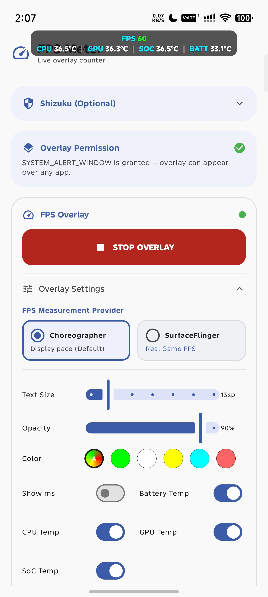
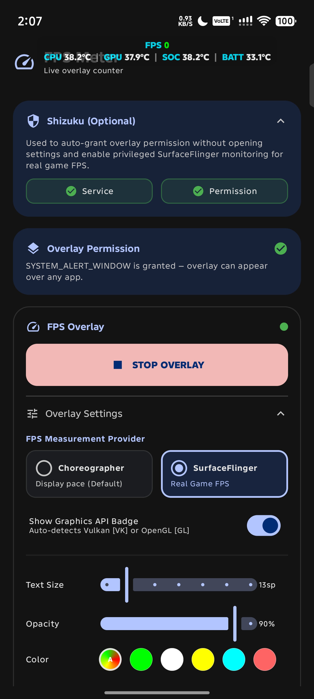
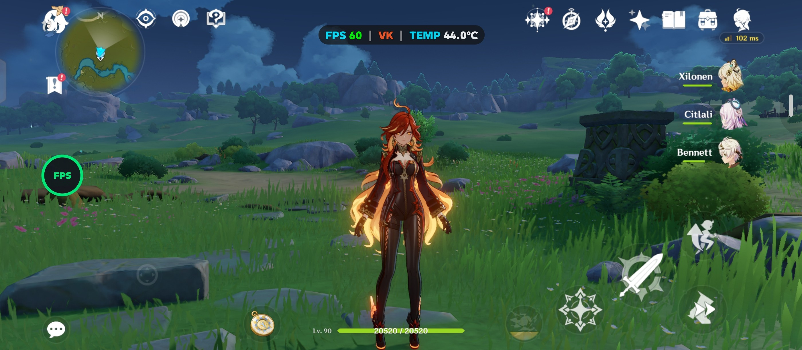

# FPS Meter Android

A high-performance, lightweight FPS monitoring tool for Android. This application provides a real-time frame rate overlay inspired by the Samsung Perf Z aesthetic, offering a professional monitoring experience for mobile gaming and performance testing.

## How It Works

> [!NOTE]
> Here is a high-level overview of how the application operates:
> - **FPS Measurement Providers**:
>   - **Choreographer (Default)**: Uses Android's `Choreographer` API to receive frame callbacks, measuring elapsed time to calculate real-time frames per second (FPS). Frame time (MS) is derived directly from this rate.
>   - **SurfaceFlinger (Game FPS via Shizuku)**: Connects to Android's compositor via privileged Shizuku shell commands to measure real game frame presentation buffers from active `SurfaceView` buffer queues.
> - **Automatic Graphics API Detection**: Automatically detects whether the foreground game is rendering with **Vulkan** or **OpenGL ES** (tested on games such as Genshin Impact and Wuthering Waves) using system GPU telemetry (`dumpsys gpu` and `dumpsys gfxinfo`), adapting the measurement method accordingly.
> - **Graceful Fallback**: Automatically falls back to Choreographer if Shizuku is unavailable, permissions are revoked, or the game is minimized.
> - **Thermal Monitoring**: Registers a dynamic `BroadcastReceiver` for `Intent.ACTION_BATTERY_CHANGED` to read and display the current battery/device temperature in real time.
> - **Overlay View**: Starts a foreground service (`FpsOverlayService`) that utilizes the Android WindowManager to draw a floating pill-shaped overlay using the `SYSTEM_ALERT_WINDOW` permission.
> - **Quick Settings Panel Tile**: Exposes an Android `TileService` (`FpsTileService`) that allows 1-tap toggling of the FPS overlay directly from the notification pull-down shade without opening the main app.
> - **Floating Assistive Bubble**: Provides an optional draggable floating on-screen bubble (`FloatingToggleButton`) that enables 1-tap show/hide of the overlay counter from inside any active game.
> - **Auto On/Off Game Detection**: An optional `AccessibilityService` (`FpsAccessibilityService`) monitors foreground window state changes to automatically activate the overlay when designated target games/apps launch and stop when exited.
> - **Interaction & Dragging**: Tracks touch gestures using an `OnTouchListener` to support real-time dragging. The updated layout coordinates are saved in `SharedPreferences` on gesture completion to persist the custom location.
> - **Shizuku Integration**: Provides privileged shell operations to grant overlay permissions without manual settings navigation, and to sample SurfaceFlinger compositor buffers for actual game FPS.

## Download latest version

Navigate to the [Releases](https://github.com/rdevz-ph/FPS-Meter-Android/releases) page to download the latest APK. For troubleshooting installation issues (Google Play Protect) or Android 13+ permission restrictions, check out the [Troubleshooting and Setup Guide](./tutorials/README.md).

## Screenshots

| Choreographer | SurfaceFlinger | In-Game Test |
|:-------------:|:--------------:|:------------:|
|  |  |  |

## Features

### FPS Measurement Providers
- **Choreographer Mode**: Standard display refresh timing with minimal system overhead. Ideal for general UI monitoring and lightweight apps.
- **SurfaceFlinger Mode**: Measures true game rendering frame rates using Shizuku privileged shell access. Directly monitors game buffer queues (SurfaceView BLAST layers).
- **Automatic Graphics API Detection**: Dynamically inspects the foreground game's rendering pipeline (via Android GPU services and dumpsys metrics) to detect Vulkan or OpenGL ES.
- **Graphics API Badge**: Displays an on-screen [VK] or [GL] badge next to the FPS value when SurfaceFlinger mode is active.
- **Graceful Fallback**: Automatically reverts to Choreographer if Shizuku permissions are revoked or if the service disconnects.

### Quick Access & Status Bar Tile
- **Quick Settings Tile**: Pull down the Android status bar / Quick Settings panel in any game and tap **FPS Meter** to start or stop the overlay instantly.
- **Floating Assistive Bubble**: A minimal draggable bubble on screen for instant 1-tap show/hide of the FPS counter without opening the app.
- **Notification Controls**: Dedicated **Hide / Show** and **Stop** action buttons directly in the persistent notification.

### Auto On/Off for Games & Apps
- **Automated Detection**: Automatically starts the FPS counter when selected games or benchmark apps launch, and automatically stops it when closed.
- **In-App App Picker**: Easily search and checkmark target apps with filter chips (**All**, **User Apps**, and **Selected**).

### Samsung-Style Aesthetic
The overlay utilizes a pill-shaped background with high-contrast, color-coded metrics for optimal visibility.
- **Labels (FPS, MS, TEMP)**: Displayed in Cyan (#00E5FF).
- **Values**: Rendered in White for clarity.
- **Dynamic FPS Color**: The FPS value automatically changes color (Green, Yellow, Orange, Red) based on real-time performance thresholds.

### Improved Horizontal Layout
The metrics are presented in a compact horizontal display using pipe separators (|). This design minimizes screen obstruction while providing essential performance data at a glance.

### Position Presets
Quick-snap presets allow for instant positioning across six key screen locations:
- Top Left, Top Center, Top Right
- Bottom Left, Bottom Center, Bottom Right
- Manual dragging is fully supported for custom placement.

### Real-time Updates
Configuration changes apply immediately to the active overlay. Adjustments to text size, opacity, color mode, provider, and visibility do not require a service restart.

### Shizuku Integration (Optional)
The setup process includes an optional Shizuku panel to auto-grant the "Display over other apps" permission, bypassing the need for manual navigation through system settings, and powers the SurfaceFlinger FPS provider.

## Requirements
- Android 8.0+ (API 26)
- Overlay Permission (SYSTEM_ALERT_WINDOW)
- Shizuku (optional, required for SurfaceFlinger real game FPS mode)

## Developer
Built by **rdevz-ph**
[GitHub Profile](https://github.com/rdevz-ph)

## License

This project is licensed under the [MIT License](LICENSE).