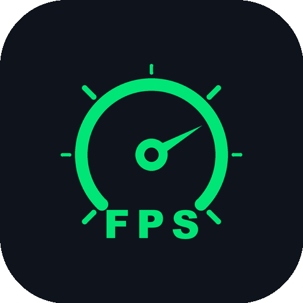
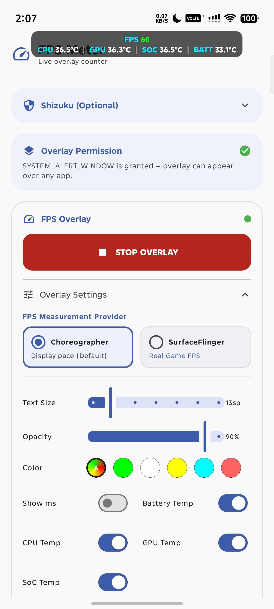
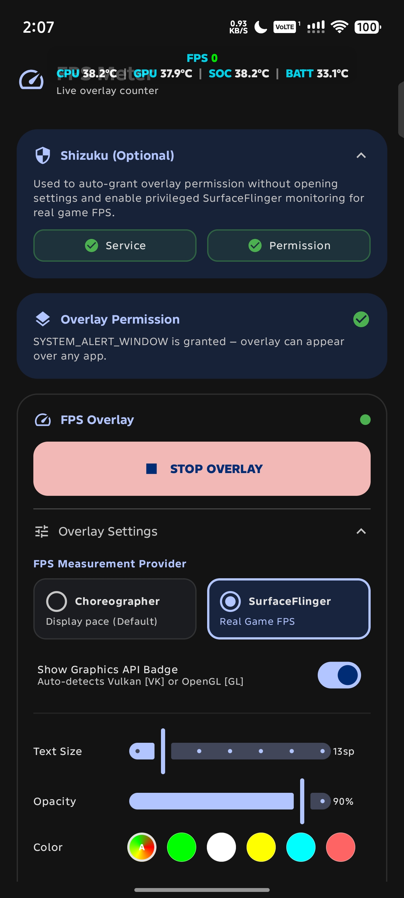
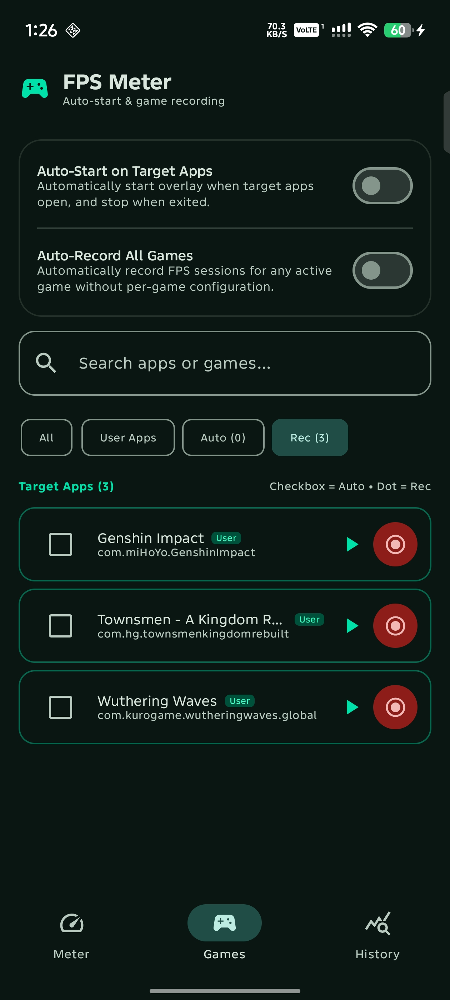
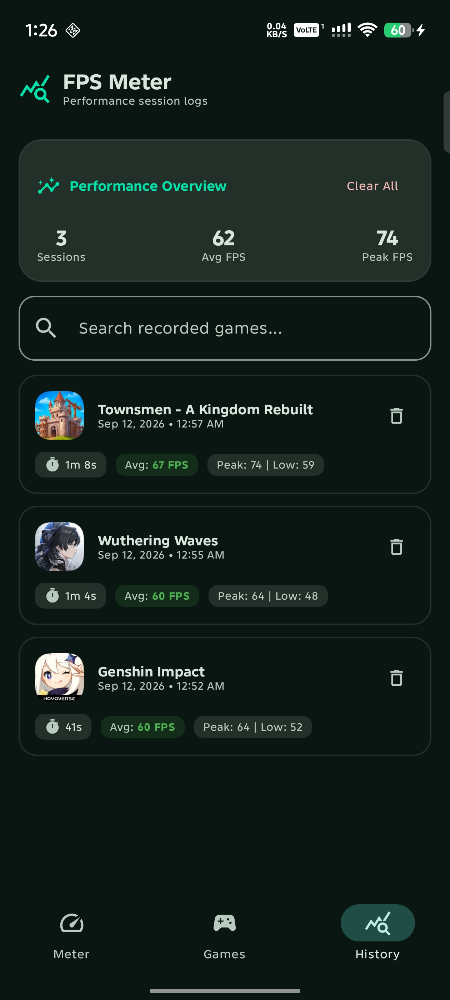
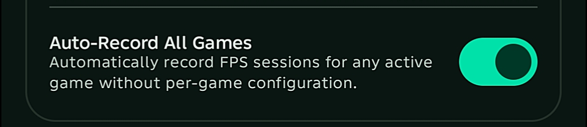
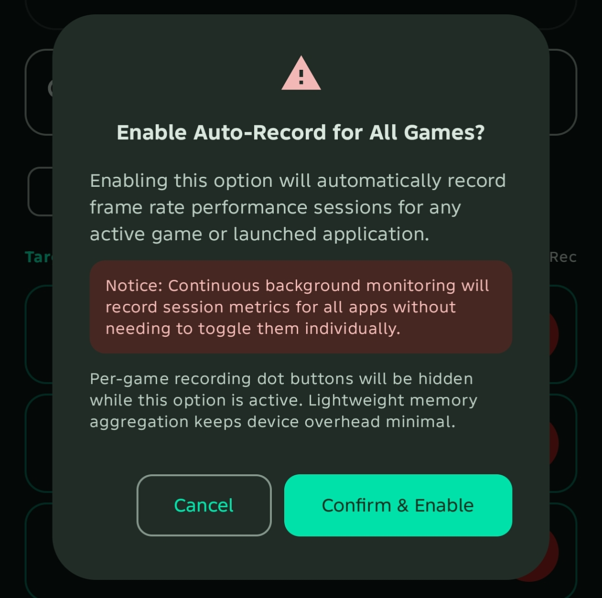
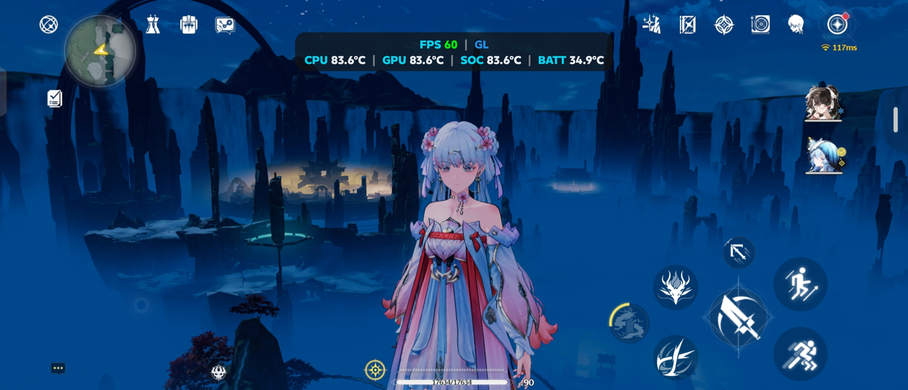
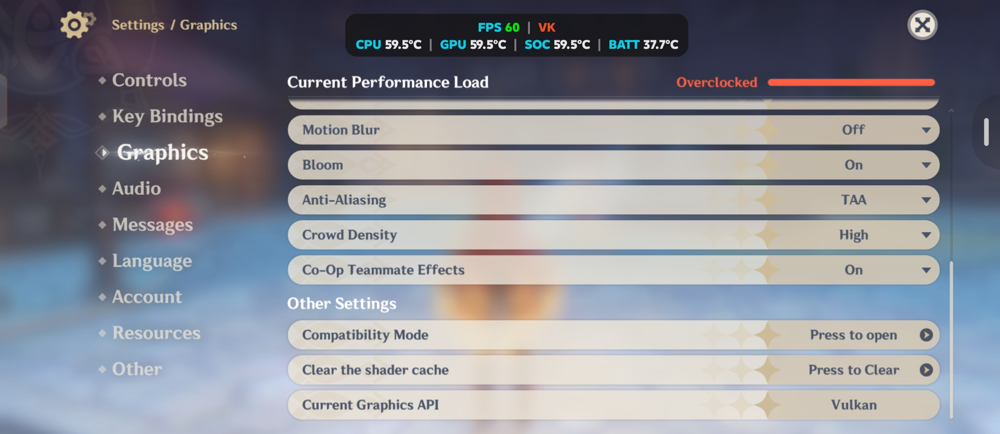

  

  # FPS Meter Android

  
  
  
  
  
  
  
  

  

    A high-performance, lightweight FPS monitoring tool for Android. This application provides a real-time frame rate overlay inspired by the Samsung Perf Z aesthetic, offering a professional monitoring experience for mobile gaming and performance testing.
      
    <strong>Official Website & Showcase:</strong> <a href="https://rdevz-ph.github.io/FPS-Meter-Android/">https://rdevz-ph.github.io/FPS-Meter-Android/</a>
  

## How It Works and Its Features

> [!NOTE]
> Here is a high-level overview of how the application operates:
> - **FPS Measurement Providers**:
>   - **Choreographer (Default)**: Uses Android's `Choreographer` API to receive frame callbacks, measuring elapsed time to calculate real-time frames per second (FPS). Frame time (MS) is derived directly from this rate.
>   - **SurfaceFlinger (Game FPS via Shizuku)**: Connects to Android's compositor via privileged Shizuku shell commands to measure real game frame presentation buffers from active `SurfaceView` buffer queues.
> - **Automatic Graphics API Detection**: Automatically detects whether the foreground game is rendering with **Vulkan** or **OpenGL ES** (tested on games such as Genshin Impact and Wuthering Waves) using system GPU telemetry (`dumpsys gpu` and `dumpsys gfxinfo`), adapting the measurement method accordingly.
> - **Hardware & Battery Telemetry**:
>   - **Battery Temperature & Charge Level (`BAT`)**: Uses a dynamic `BroadcastReceiver` for `Intent.ACTION_BATTERY_CHANGED` to monitor real-time battery temperature and remaining charge percentage (`BAT xx%`) for fullscreen gaming. When both are enabled, they automatically merge into a unified indicator: `BAT <temp> (<level>)` (e.g. `BAT 38°C (85%)`).
>   - **SoC, CPU & GPU Temps (`SOC`, `CPU`, `GPU`)**: Queries Android's Thermal HAL (`dumpsys thermalservice`) and Linux sysfs thermal zones (`cpu-*-usr`, `gpuss-*-usr`) via Shizuku privileged shell access to monitor accurate live silicon hotspot, individual CPU core, and GPU temperatures during gaming across Qualcomm Snapdragon and MediaTek platforms.
> - **Adaptive Dynamic Layout**: Automatically presents a clean single-line pill when 1 to 3 metrics are enabled, and organizes into a structured two-line layout (Line 1: Performance metrics, Line 2: Temperatures) when 4 or more metrics are active.
> - **Material 3 Navigation & Dedicated Screens**: Modern navigation featuring Overlay settings, Games manager with 1-tap game launching, and dedicated FPS session History with per-app launcher icons.
> - **Universal Auto-Record & Per-Game Recording**: Choose between universal automated session recording for all active games or per-app configuration, aggregating average, min, and max FPS and duration with zero sample-by-sample disk overhead.
> - **Floating Assistive Bubble & Quick Menu**: Provides an optional draggable floating on-screen bubble (`FloatingToggleButton`) that expands into a quick HUD menu to start/stop game FPS recording, toggle overlay visibility, and return to the app from inside any active game.
> - **Quick Settings Panel Tile**: Exposes an Android `TileService` (`FpsTileService`) that allows 1-tap toggling of the FPS overlay directly from the notification pull-down shade without opening the main app.
> - **Auto On/Off Game Detection**: An optional `AccessibilityService` (`FpsAccessibilityService`) monitors foreground window state changes to automatically activate the overlay when designated target games/apps launch and stop when exited.
> - **Interaction & Dragging**: Tracks touch gestures using an `OnTouchListener` to support real-time dragging. The updated layout coordinates are saved in `SharedPreferences` on gesture completion to persist the custom location.
> - **Shizuku Integration**: Provides privileged shell operations to grant overlay permissions without manual settings navigation, and to sample SurfaceFlinger compositor buffers for actual game FPS.

## Download

  
  &nbsp;&nbsp;
  

Visit the [Official Website & Showcase](https://rdevz-ph.github.io/FPS-Meter-Android/) to explore interactive features, test screenshots, and view full release changelogs. You can also navigate directly to the [Releases](https://github.com/rdevz-ph/FPS-Meter-Android/releases) page to download the latest APK or install and receive automated updates via [ShizuStore](https://awesome-shizuku.vercel.app/apps/fps-meter-android). For troubleshooting installation issues (Google Play Protect) or Android 13+ permission restrictions, check out the [Troubleshooting and Setup Guide](./tutorials/README.md).

## Screenshots

### Application Interface
| Meter & Telemetry | SurfaceFlinger & Shizuku | Games & Auto-Recording | Performance History Logs |
|:-----------------:|:------------------------:|:----------------------:|:------------------------:|
|  |  |  |  |

| Auto-Record All Games Toggle | Confirmation Notice Dialog |
|:----------------------------:|:--------------------------:|
|  |  |

### In-Game Performance Testing
| OpenGL ES `[GL]` | Vulkan `[VK]` |
|:----------------:|:-------------:|
|  |  |

> [!TIP]
> This app theme follows system colors (Material You Dynamic Color), so UI accents and theme colors will adapt to your device's active wallpaper and system palette.

## Requirements
- Android 8.0+ (API 26)
- Overlay Permission (SYSTEM_ALERT_WINDOW)
- Shizuku (optional, required for SurfaceFlinger real game FPS mode)

## Developer
Built by **Romel** ([@rdevz-ph](https://github.com/rdevz-ph))
- Portfolio: [https://romel-portfolio.vercel.app/](https://romel-portfolio.vercel.app/)
- GitHub: [https://github.com/rdevz-ph](https://github.com/rdevz-ph)

## Privacy Policy
FPS Meter Android operates completely offline. It does not collect, monitor, or transmit any personal data. You can read the full policy at [Privacy Policy](https://rdevz-ph.github.io/FPS-Meter-Android/privacy.html).

## Contributing

Contributions are always welcome. Check out our [Contributing Guide](CONTRIBUTING.md) to get started.

If you are interested in translating FPS Meter to your language, take a look at our [Translation Guide and Template](TRANSLATION_TEMPLATE.md).

## License

This project is licensed under the [MIT License](LICENSE).