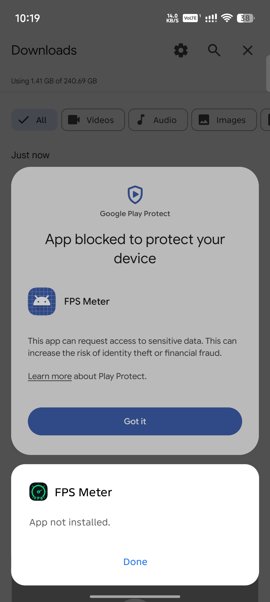
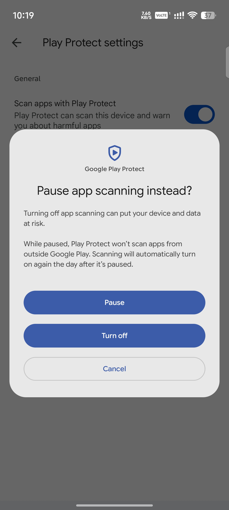
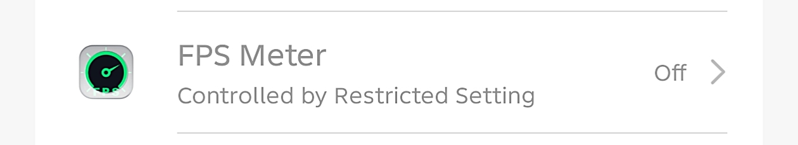
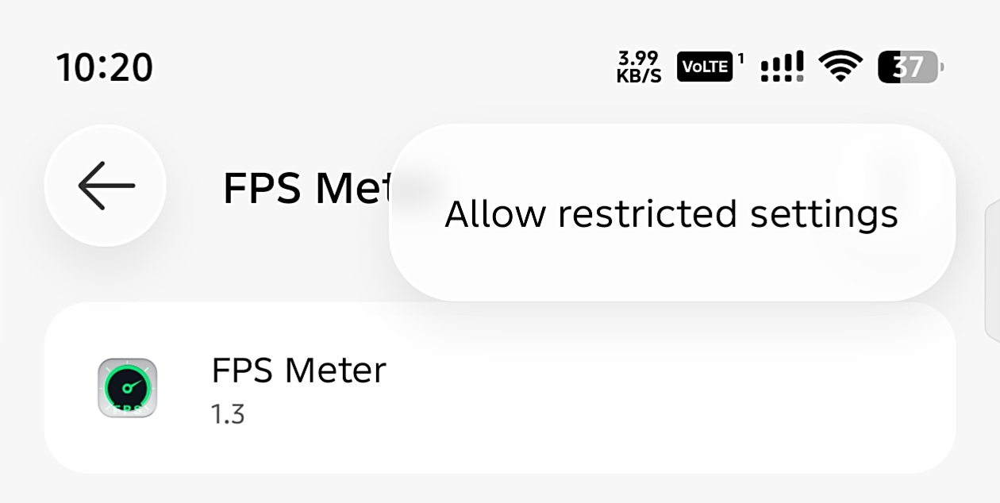

# Troubleshooting and Setup Guides

This guide provides step-by-step solutions for common installation and permission issues encountered when setting up FPS Meter on Android devices.

---

## 1. Google Play Protect Blocking Installation

### Issue
When sideloading or installing the APK, Google Play Protect may display a warning dialog stating **"App blocked to protect your device"** or prevent the package installer with an **"App not installed"** error.

| Blocked Prompt |
|:---:|
|  |

### Cause
Sideloaded applications downloaded outside the Google Play Store that declare sensitive system capabilities (such as Accessibility Services or System Overlay permissions) may be flagged by Play Protect scanning algorithms.

### Solution

#### Method 1: Install Anyway Prompt
1. On the Play Protect blocked prompt, tap **More details** (if visible).
2. Tap **Install anyway** to continue with the installation.

#### Method 2: Temporarily Pause or Disable Play Protect
1. Open the **Google Play Store** app.
2. Tap your **Profile icon** in the top right corner.
3. Tap **Play Protect**.
4. Tap the **Settings (gear icon)** in the top right corner.
5. Toggle off **Scan apps with Play Protect**.
6. When prompted with "Pause app scanning instead?" or "Turn off app scanning?", select **Pause** or **Turn off**.
7. Return to your file manager or browser and install the FPS Meter APK.
8. (Optional) Re-enable Play Protect scanning after installation is complete.

| Play Protect Settings |
|:---:|
|  |

---

## 2. Restricted Settings for Accessibility Service (Android 13+)

### Issue
When attempting to enable the **FPS Meter Accessibility Service** (required for automated game detection and auto on/off features) inside Android Accessibility Settings, the toggle is grayed out and displays **"Controlled by Restricted Setting"** or **"Restricted setting"**.

| Restricted Setting State |
|:---:|
|  |

### Cause
Beginning with Android 13 (API 33), Android automatically restricts sideloaded APKs from accessing sensitive permissions (such as Accessibility Services and Notification Access) until the user explicitly permits restricted settings for that specific app.

### Solution

1. Open device **Settings**.
2. Navigate to **Apps** (or **App management** / **Installed apps**).
3. Locate and tap **FPS Meter** to open its **App Info** page.
4. Tap the **three dots menu** (More options) in the top-right corner of the screen.
5. Tap **Allow restricted settings**.
6. Verify your identity using your device lock screen credentials (PIN, pattern, password, or fingerprint).
7. Return to **Settings** > **Accessibility** > **Downloaded apps** > **FPS Meter**.
8. The Accessibility toggle is now unlocked. Turn the switch **On** to enable automated game detection.

| Allow Restricted Settings |
|:---:|
|  |
